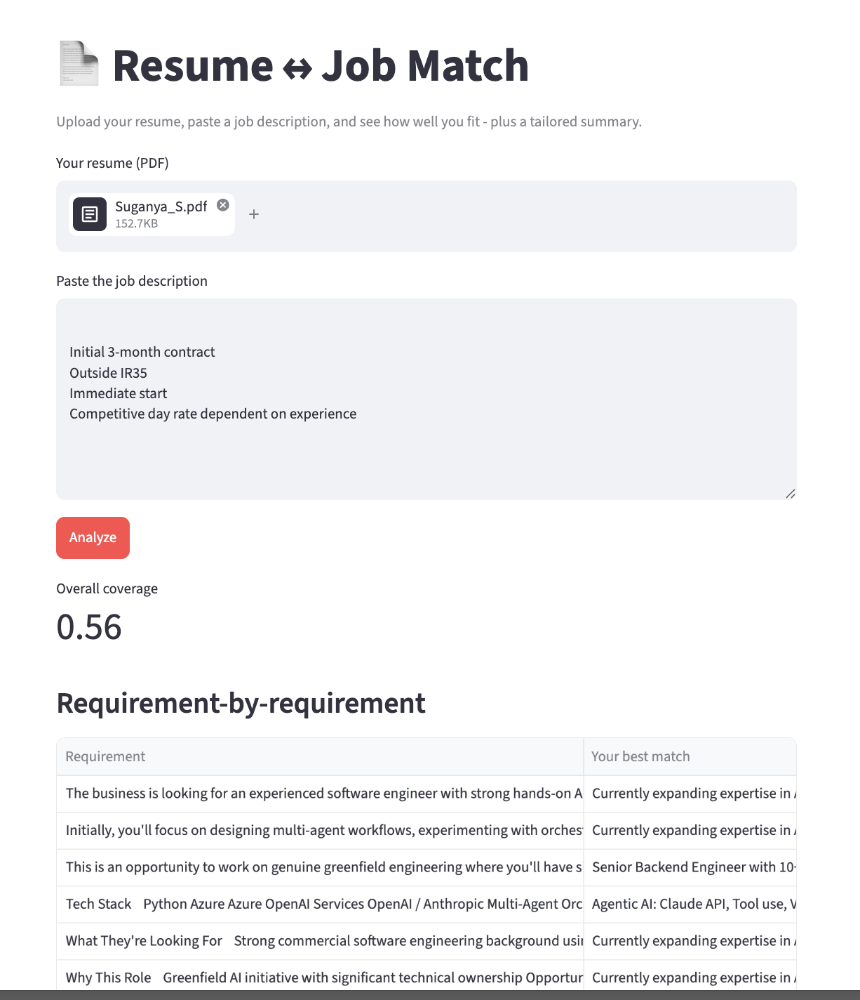

# 📄 Résumé ↔ Job Matcher

Paste a job description, upload your résumé, and instantly see **how well you fit** — which of your experiences to lead with, where the **gaps** are, and a **tailored summary** written *only* from your real experience.

**🔗 Live demo:** https://freeresumematcher.streamlit.app/

> Semantic matching, not keyword matching. "Strong SQL required" matches your *"optimised PostgreSQL queries"* bullet even though they share no keywords — because the app compares **meaning**, using text embeddings.



---

## What it does

1. **Upload a résumé (PDF)** and **paste a job description.**
2. Get an **overall coverage score** — how well your experience fits the role.
3. See a **requirement-by-requirement breakdown** — each JD requirement matched to your most relevant bullet, flagged ✅ covered or ⚠️ gap.
4. Get the **bullets to lead with** for this specific role.
5. Get a **tailored professional summary** — grounded strictly in your real experience, with **no fabricated skills.**

## Features

- **Semantic matching** — ranks by meaning, not keyword overlap.
- **Gap analysis** — surfaces requirements your résumé doesn't cover, so you know what to address.
- **Grounded generation** — the tailored summary is constrained to your real bullets; it will *refuse* to invent experience and will flag missing requirements instead.
- **Robust résumé parsing** — handles messy PDF layouts by using an LLM to segment the résumé into clean, self-contained bullets.

## How it works

```
résumé.pdf ─► extract text ─► LLM segments into clean bullets ─┐
                                                               ├─► embed both ─► cosine similarity
job description ─► split into individual requirements ─────────┘        │
                                                                        ▼
                            per-requirement best match + gaps  +  tailored summary (grounded RAG)
```

- **Extraction & segmentation** (`ingest.py`) — `pdfplumber` pulls raw text; Claude then segments it into clean, self-contained bullets via **structured output** (rule-based splitting was too brittle for varied résumé layouts, so the fuzzy "where does a bullet start?" judgment is delegated to the model).
- **Matching** (`matcher.py`) — the résumé bullets and each JD requirement are turned into **embeddings** (vectors that capture meaning). Relevance is **cosine similarity**; each requirement is matched to its best bullet, and low-scoring requirements are flagged as gaps.
- **Tailored summary** (`matcher.py`) — a **retrieval-augmented generation** step: the top-matching bullets are retrieved and passed to Claude with a strict instruction to use *only* that real experience.
- **UI** (`app.py`) — a thin Streamlit layer that collects input, calls the pipeline, and renders the results.

## Tech stack

- **Python** + **Streamlit** (UI & hosting)
- **[Voyage AI](https://www.voyageai.com/)** `voyage-4` — text embeddings
- **[Anthropic Claude](https://www.anthropic.com/)** `claude-opus-4-8` — résumé segmentation & tailored summary
- **pdfplumber** — PDF text extraction · **NumPy** — vector math

## Project structure

```
ingest.py      # PDF → text → clean bullets (extraction + LLM segmentation)
matcher.py     # embeddings, per-requirement matching, gap analysis, tailored summary
app.py         # Streamlit UI — wires it together
requirements.txt
```

## Run it locally

```bash
git clone https://github.com/suganyaS10/resume_matcher.git
cd resume_matcher

python3 -m venv venv
source venv/bin/activate
pip install -r requirements.txt

cp .env.example .env        # then add your VOYAGE_API_KEY and ANTHROPIC_API_KEY

streamlit run app.py
```

You'll need free API keys from [Voyage AI](https://www.voyageai.com/) and [Anthropic](https://console.anthropic.com/).

## Notes & limitations

- **Gap threshold is heuristic.** Cosine scores are relative, not absolute — unrelated professional text still scores ~0.35–0.45, so a "gap" means *relatively* low, not near-zero. The cutoff is tunable per use case.
- **Grounded, but review the output.** The tailored summary is instructed not to fabricate, and in testing it reliably declines to — but always read it before using it in an application.

## License

MIT — see `LICENSE` (feel free to swap for your preferred license).

---

Built by [@suganyaS10](https://github.com/suganyaS10) while learning embeddings and RAG, hands-on.
